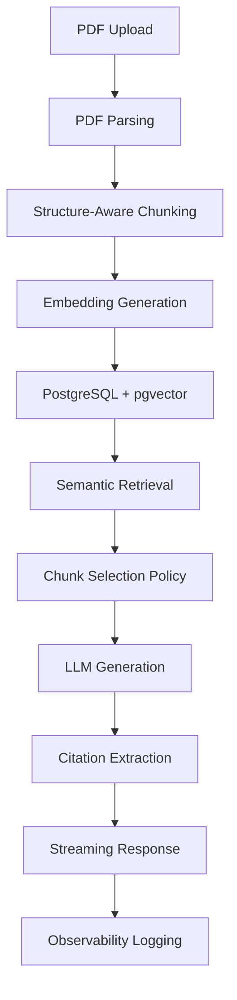

# Docs Diver

### AI-powered document intelligence workspace

Docs Diver is a Retrieval-Augmented Generation (RAG) application that allows users to upload PDF documents, index them using semantic embeddings, and ask questions grounded in the uploaded content.

The goal of the project was to explore the practical challenges involved in building production-oriented AI applications, including document ingestion, semantic retrieval, citation grounding, observability, evaluation, and cost-aware usage controls.

---

## Key Features

### Document Ingestion

Users can upload PDF documents that are automatically:

- parsed
- cleaned
- chunked
- embedded
- indexed into PostgreSQL with pgvector

---

### Structure-Aware Chunking

Instead of splitting documents at arbitrary character boundaries, Docs Diver attempts to preserve document structure by chunking around:

- headings
- sections
- paragraph boundaries
- sentence boundaries

This produces more coherent chunks and improves retrieval quality.

---

### Semantic Search

Each chunk is converted into a vector embedding using OpenAI embeddings and stored in PostgreSQL using pgvector.

When a user asks a question:

1. The query is embedded.
2. Vector similarity search retrieves the most relevant chunks.
3. Retrieved chunks are filtered through a chunk selection policy.

---

### Retrieval Selection Policy

Docs Diver does not blindly send all retrieved chunks to the LLM.

Retrieved chunks are filtered using:

- similarity thresholds
- token budget constraints
- maximum chunk limits

This reduces noise, lowers cost, and improves answer quality.

---

### Streaming AI Chat

Answers are generated using OpenAI models and streamed in real time using the Vercel AI SDK.

Each workspace maintains a persistent conversation history.

---

### Citation Grounding

Retrieved chunks are converted into structured citations.

Assistant messages persist:

- answer content
- citation metadata
- document references
- chunk references

allowing answers to remain inspectable after page refreshes.

---

### Source Inspection

Users can inspect the chunks used to answer a question.

The application provides:

- retrieved chunk previews
- similarity scores
- PDF page previews
- chunk excerpts

This makes the retrieval process transparent and debuggable.

---

### Retrieval Observability

Every AI request is logged.

Stored metrics include:

- model used
- latency
- estimated token counts
- retrieved chunks
- chunk similarity scores
- chunk usage information

This provides visibility into system behavior and retrieval quality.

---

### Evaluation Workspace

Docs Diver includes a lightweight evaluation interface that allows inspection of:

- retrieval ranking
- cited chunks
- similarity scores
- chunk usage patterns

This helps analyze whether the retrieval pipeline is surfacing the most useful context.

---

## Technology Stack

- Next.js App Router
- TypeScript
- Prisma ORM
- PostgreSQL
- pgvector
- OpenAI
- Vercel AI SDK
- React PDF

---

## System Architecture

